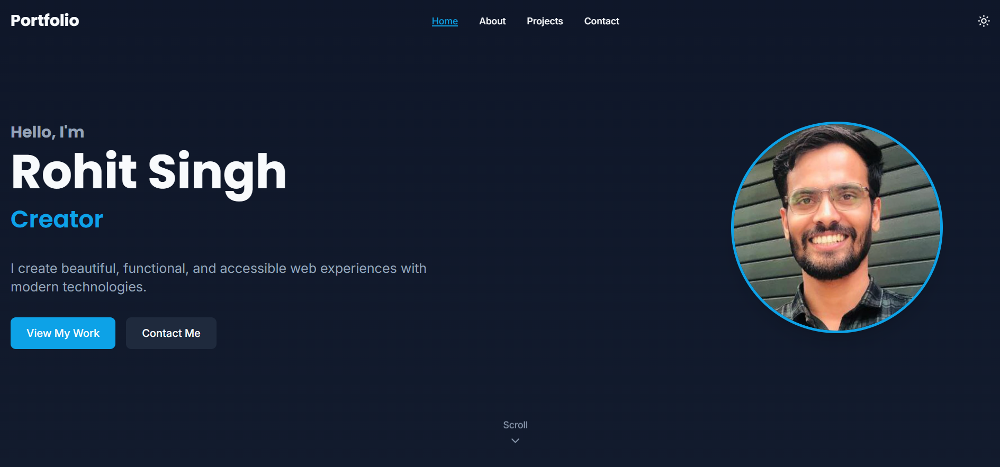

# Portfolio Website

This is the source code for my personal portfolio website — a place to showcase my work, skills, and ways to connect with me.

## Live Demo

Check it out here: [https://rohitsinghthakur.netlify.app/](https://rohitsinghthakur.netlify.app/)

---

## Tech Stack

- HTML5
- CSS3 / Tailwind CSS / SCSS
- JavaScript / React
- Deployment: Netlify

---

## Features

- Fully responsive design
- Project showcase section with live links
- About me and skills overview
- Contact form / social media links
- Smooth animations and transitions
- Light/Dark mode

---

## Screenshots



---

## Installation

To run this project locally:

```bash
# Clone the repo
git clone https://github.com/yourusername/portfolio-website.git

# Move into the directory
cd portfolio-website

# Install dependencies (if using a framework like React)
npm install

# Start the development server
npm run dev

```

## Contact

Email: thakurrohitsingh04@gmail.com  
LinkedIn: [linkedin.com/in/rohit-singh-thakur04](https://linkedin.com/in/rohit-singh-thakur04)
